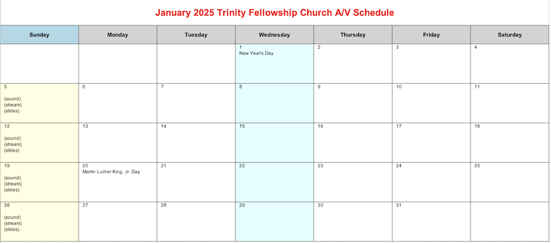

# CreateSoundRoomSchedule

[](https://github.com/markjulmar/CreateSoundRoomSchedule/actions/workflows/dotnet.yml)

## Overview
The `CreateSoundRoomSchedule` project is a C# application to generate an Excel spreadsheet with the planned services for a church. It interacts with the [Planning Center](https://www.planningcenter.com/) API to create a three-month calendar set for a given quarter. This .NET 8 application reads data from Planning Center Online for all planned services in a specific quarter. It generates an Excel spreadsheet containing a 3-month calendar to identify the people assigned to manage A/V weekly. It also pulls public holidays and includes them in the calendar data.



### Dependencies
- **Language**: C#
- **Framework**: .NET 10.0
- **Main Libraries**: [EPPlus](https://www.epplussoftware.com/)

## Requirements
Add a .NET User Secret with a Client Id and Client Secret obtained from the Planning Center development dashboard.

| Key | Description |
|-----|-------------|
| `PlanningCenter:clientId` | Client Id for a PAT assigned by Planning Center. |
| `PlanningCenter:clientSecret` | Corresponding PAT secret for the assigned client id. |

## Running the app
Run the app from the console:

```console
dotnet run
```

By default, it generates a calendar for the _next_ quarter. You can also provide a single date argument in `M/d/yyyy` format, and the app will generate the calendar for the quarter containing that date. The resulting file is written to the desktop and named **TFC_SoundRoom_Schedule_YYYY-QX.xlsx**. If a file with that name already exists, it is replaced.

```console
dotnet run 2/1/2025
```

This command would create a Q1 2025 calendar spanning January - March.

If the date argument is missing or invalid, the app falls back to the next quarter.

## Output details
The workbook contains one worksheet per month for the selected quarter. Each sheet is formatted for landscape printing and is scaled to fit the page width without forcing the month onto a single page vertically. This keeps the calendar easier to read when printed.
